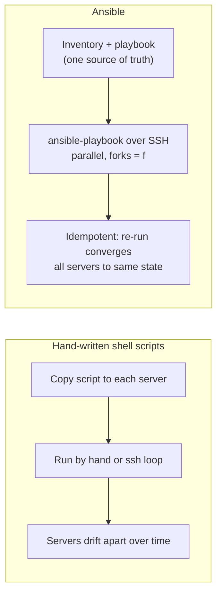

# Diagram D10 – Shell Scripts versus Ansible (supports A2 alternative analysis)

```mermaid
flowchart LR
    subgraph SH["Hand-written shell scripts"]
        S1["Copy script to each server"] --> S2["Run by hand or ssh loop"]
        S2 --> S3["Servers drift apart over time"]
    end
    subgraph AN["Ansible"]
        A1["Inventory + playbook<br/>(one source of truth)"] --> A2["ansible-playbook over SSH<br/>parallel, forks = f"]
        A2 --> A3["Idempotent: re-run converges<br/>all servers to same state"]
    end
```
