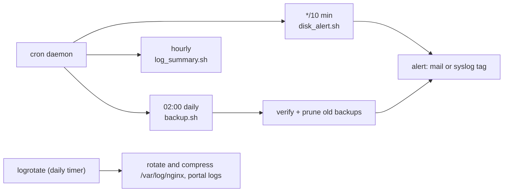

# Diagram D9 – Automation Schedule (supports A2.3)

```mermaid
flowchart LR
    CRON["cron daemon"] --> D1["*/10 min<br/>disk_alert.sh"]
    CRON --> D2["hourly<br/>log_summary.sh"]
    CRON --> D3["02:00 daily<br/>backup.sh"]
    D3 --> V["verify + prune old backups"]
    LR["logrotate (daily timer)"] --> ROT["rotate and compress /var/log/nginx, portal logs"]
    D1 --> AL["alert: mail or syslog tag"]
    V --> AL
```
