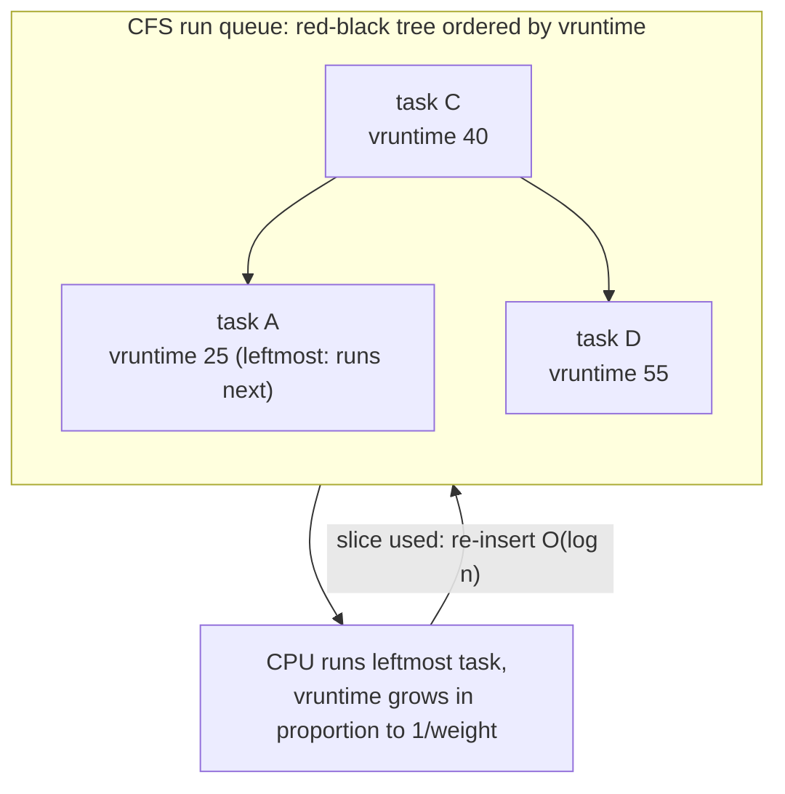
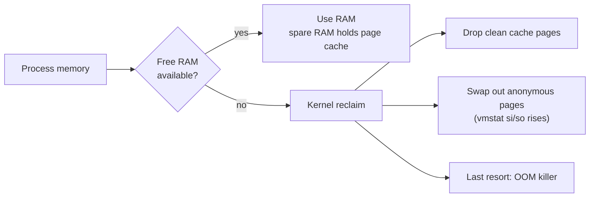

# Diagram D3 – CFS Run Queue and Page Cache / Swap (supports A1.2)

```mermaid
flowchart TB
    subgraph RQ["CFS run queue: red-black tree ordered by vruntime"]
        direction TB
        R["task C<br/>vruntime 40"]
        R --> L["task A<br/>vruntime 25 (leftmost: runs next)"]
        R --> Rt["task D<br/>vruntime 55"]
    end
    RQ --> CPU["CPU runs leftmost task,<br/>vruntime grows in proportion to 1/weight"]
    CPU -->|"slice used: re-insert O(log n)"| RQ
```

```mermaid
flowchart LR
    APPM["Process memory"] --> FREE{"Free RAM<br/>available?"}
    FREE -- yes --> USE["Use RAM<br/>spare RAM holds page cache"]
    FREE -- no --> RECL["Kernel reclaim"]
    RECL --> CLEAN["Drop clean cache pages"]
    RECL --> SWAP["Swap out anonymous pages<br/>(vmstat si/so rises)"]
    RECL --> OOM["Last resort: OOM killer"]
```
