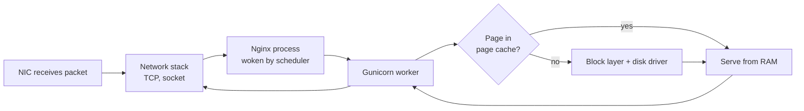

# Diagram D2 – Kernel Subsystems and the Portal Request (supports A1.1)

```mermaid
flowchart LR
    NIC["NIC receives packet"] --> NET["Network stack<br/>TCP, socket"]
    NET --> NG["Nginx process<br/>woken by scheduler"]
    NG --> GU["Gunicorn worker"]
    GU --> PC{"Page in<br/>page cache?"}
    PC -- yes --> RAM["Serve from RAM"]
    PC -- no --> BLK["Block layer + disk driver"]
    BLK --> RAM
    RAM --> GU
    GU --> NET
```
