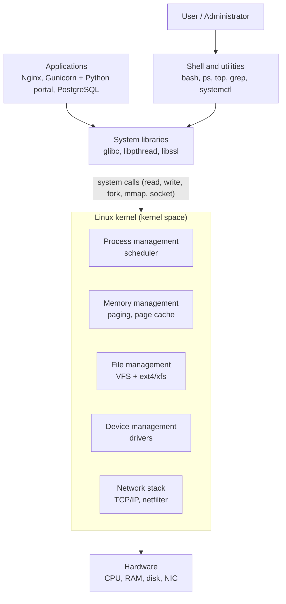

# Diagram D1 – Linux Layered Architecture (supports A1.1)

```mermaid
flowchart TB
    U["User / Administrator"] --> SH["Shell and utilities<br/>bash, ps, top, grep, systemctl"]
    APP["Applications<br/>Nginx, Gunicorn + Python portal, PostgreSQL"] --> LIB
    SH --> LIB["System libraries<br/>glibc, libpthread, libssl"]
    LIB -->|"system calls (read, write, fork, mmap, socket)"| K
    subgraph K["Linux kernel (kernel space)"]
        PM["Process management<br/>scheduler"]
        MM["Memory management<br/>paging, page cache"]
        FS["File management<br/>VFS + ext4/xfs"]
        DM["Device management<br/>drivers"]
        NM["Network stack<br/>TCP/IP, netfilter"]
    end
    K --> HW["Hardware<br/>CPU, RAM, disk, NIC"]
```
