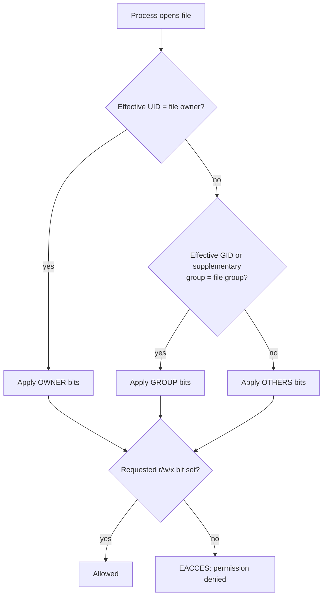
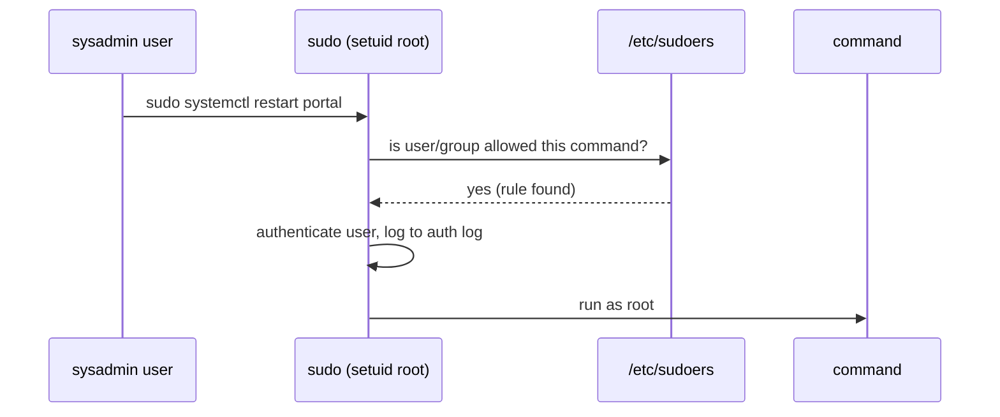

# Diagram D6 – Permission Check and sudo (supports A1.3)

```mermaid
flowchart TD
    A["Process opens file"] --> B{"Effective UID = file owner?"}
    B -- yes --> O["Apply OWNER bits"]
    B -- no --> C{"Effective GID or supplementary<br/>group = file group?"}
    C -- yes --> G["Apply GROUP bits"]
    C -- no --> T["Apply OTHERS bits"]
    O --> D{"Requested r/w/x bit set?"}
    G --> D
    T --> D
    D -- yes --> OK["Allowed"]
    D -- no --> NO["EACCES: permission denied"]
```

```mermaid
sequenceDiagram
    participant U as sysadmin user
    participant S as sudo (setuid root)
    participant F as /etc/sudoers
    participant C as command
    U->>S: sudo systemctl restart portal
    S->>F: is user/group allowed this command?
    F-->>S: yes (rule found)
    S->>S: authenticate user, log to auth log
    S->>C: run as root
```
