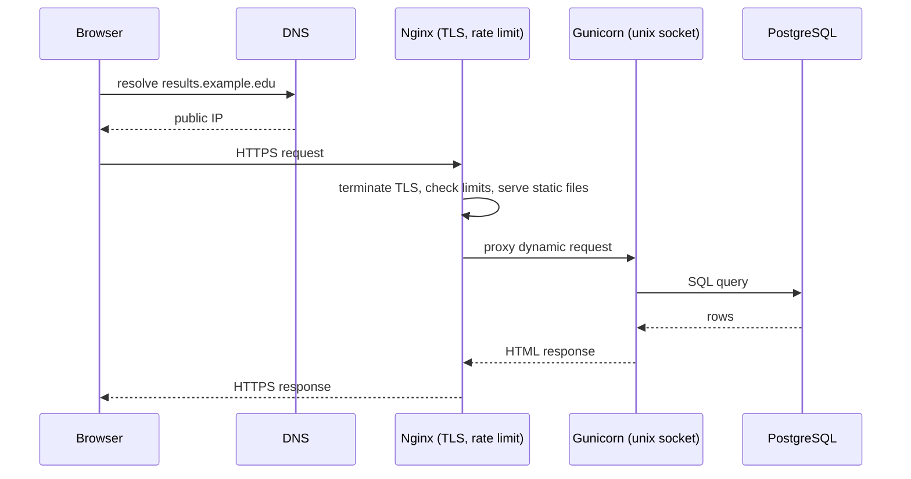

# Diagram D8 – Request Flow Through Nginx (supports A2.2)

```mermaid
sequenceDiagram
    participant B as Browser
    participant D as DNS
    participant N as Nginx (TLS, rate limit)
    participant G as Gunicorn (unix socket)
    participant P as PostgreSQL
    B->>D: resolve results.example.edu
    D-->>B: public IP
    B->>N: HTTPS request
    N->>N: terminate TLS, check limits, serve static files
    N->>G: proxy dynamic request
    G->>P: SQL query
    P-->>G: rows
    G-->>N: HTML response
    N-->>B: HTTPS response
```
