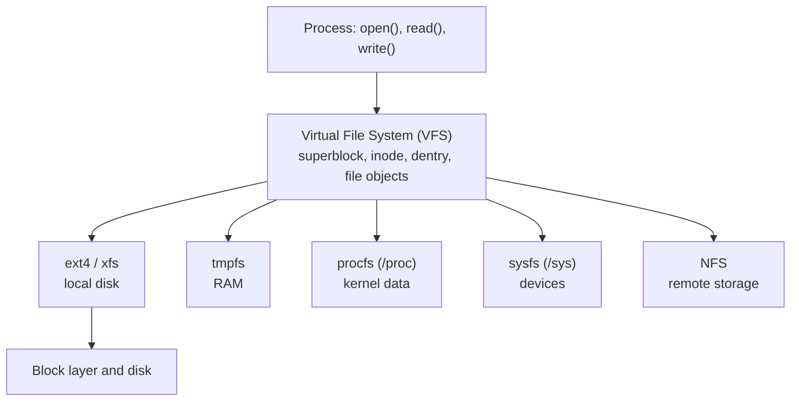

# Diagram D4 – Virtual File System Layers (supports A1.3)

```mermaid
flowchart TB
    P["Process: open(), read(), write()"] --> V["Virtual File System (VFS)<br/>superblock, inode, dentry, file objects"]
    V --> E4["ext4 / xfs<br/>local disk"]
    V --> TM["tmpfs<br/>RAM"]
    V --> PR["procfs (/proc)<br/>kernel data"]
    V --> SY["sysfs (/sys)<br/>devices"]
    V --> NF["NFS<br/>remote storage"]
    E4 --> BL["Block layer and disk"]
```
