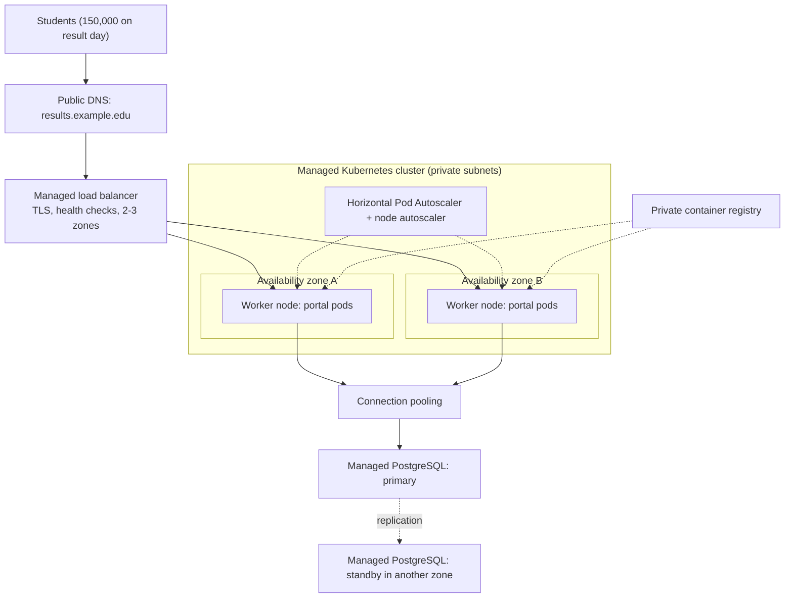

# Diagram D14 – Cloud Deployment for Result Day (supports A5.1)

```mermaid
flowchart TB
    S["Students (150,000 on result day)"]
    DNS["Public DNS: results.example.edu"]
    LB["Managed load balancer<br/>TLS, health checks, 2-3 zones"]
    subgraph K["Managed Kubernetes cluster (private subnets)"]
        direction TB
        subgraph ZA["Availability zone A"]
            NA["Worker node: portal pods"]
        end
        subgraph ZB["Availability zone B"]
            NB["Worker node: portal pods"]
        end
        HPA["Horizontal Pod Autoscaler + node autoscaler"]
    end
    REG["Private container registry"]
    P["Connection pooling"]
    DBP["Managed PostgreSQL: primary"]
    DBS["Managed PostgreSQL: standby in another zone"]
    S --> DNS --> LB
    LB --> NA
    LB --> NB
    HPA -.-> NA
    HPA -.-> NB
    REG -.-> NA
    REG -.-> NB
    NA --> P
    NB --> P
    P --> DBP
    DBP -. "replication" .-> DBS
```
