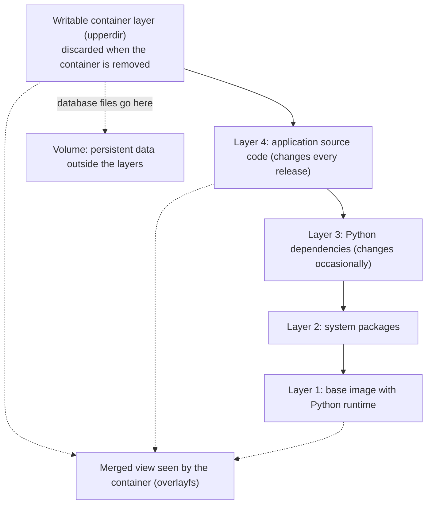

# Diagram D13 – Container Image Layers and Copy-on-Write (supports A4.1)

```mermaid
flowchart TB
    W["Writable container layer (upperdir)<br/>discarded when the container is removed"]
    L4["Layer 4: application source code (changes every release)"]
    L3["Layer 3: Python dependencies (changes occasionally)"]
    L2["Layer 2: system packages"]
    L1["Layer 1: base image with Python runtime"]
    M["Merged view seen by the container (overlayfs)"]
    V["Volume: persistent data outside the layers"]
    W --> L4 --> L3 --> L2 --> L1
    W -.-> M
    L4 -.-> M
    L1 -.-> M
    W -. "database files go here" .-> V
```

Layers 1–4 are read-only and shared by all containers made from the image; only the top layer is private to a container.
