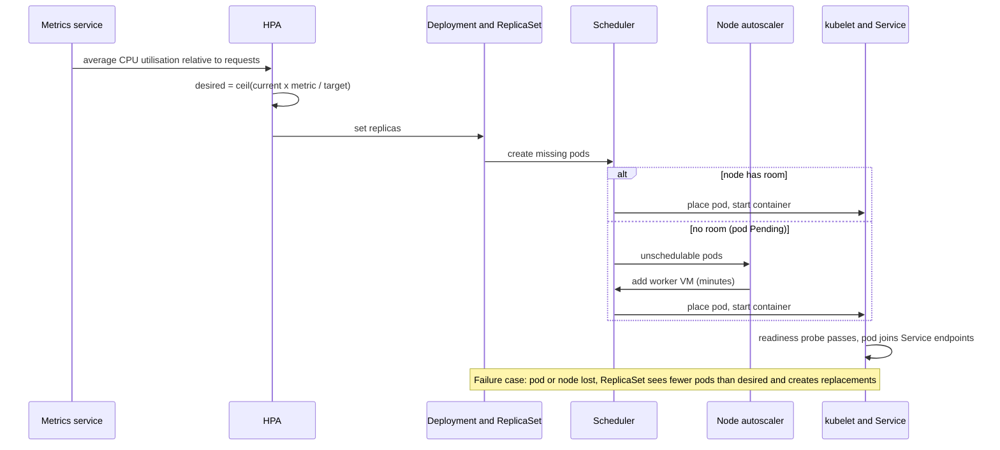

# Diagram D16 – Autoscaling and Self-Healing Control Loops (supports A5.2)

```mermaid
sequenceDiagram
    participant M as Metrics service
    participant H as HPA
    participant D as Deployment and ReplicaSet
    participant S as Scheduler
    participant N as Node autoscaler
    participant K as kubelet and Service
    M->>H: average CPU utilisation relative to requests
    H->>H: desired = ceil(current x metric / target)
    H->>D: set replicas
    D->>S: create missing pods
    alt node has room
        S->>K: place pod, start container
    else no room (pod Pending)
        S->>N: unschedulable pods
        N->>S: add worker VM (minutes)
        S->>K: place pod, start container
    end
    K->>K: readiness probe passes, pod joins Service endpoints
    Note over K,D: Failure case: pod or node lost, ReplicaSet sees fewer pods than desired and creates replacements
```
