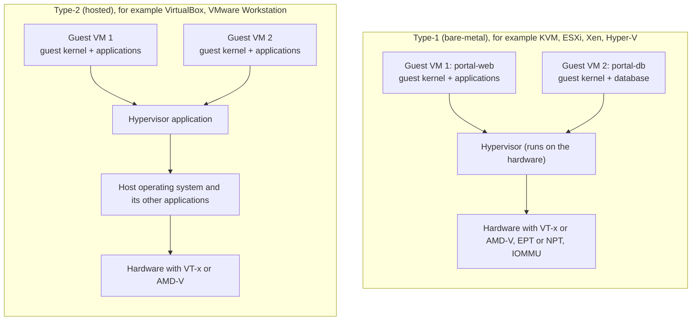

# Diagram D11 – Type-1 and Type-2 Hypervisors (supports A3.1 and the A3 alternative)

```mermaid
flowchart TB
    subgraph T1["Type-1 (bare-metal), for example KVM, ESXi, Xen, Hyper-V"]
        direction TB
        A1["Guest VM 1: portal-web<br/>guest kernel + applications"]
        A2["Guest VM 2: portal-db<br/>guest kernel + database"]
        AH["Hypervisor (runs on the hardware)"]
        AHW["Hardware with VT-x or AMD-V, EPT or NPT, IOMMU"]
        A1 --> AH
        A2 --> AH
        AH --> AHW
    end
    subgraph T2["Type-2 (hosted), for example VirtualBox, VMware Workstation"]
        direction TB
        B1["Guest VM 1<br/>guest kernel + applications"]
        B2["Guest VM 2<br/>guest kernel + applications"]
        BH["Hypervisor application"]
        BO["Host operating system and its other applications"]
        BHW["Hardware with VT-x or AMD-V"]
        B1 --> BH
        B2 --> BH
        BH --> BO
        BO --> BHW
    end
```

Type-2 has one extra layer (the host OS) between the guests and the hardware.
