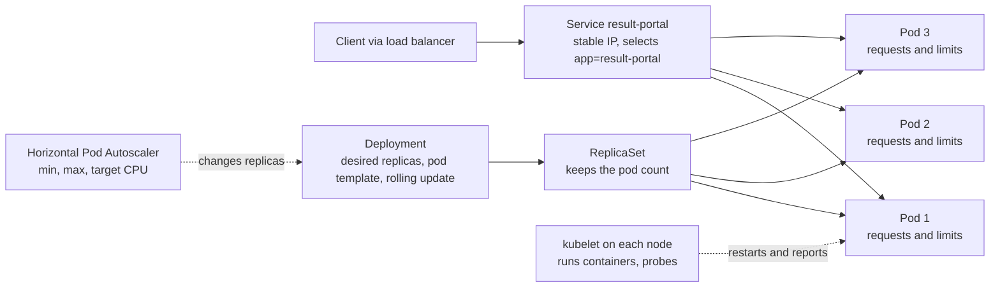

# Diagram D15 – Kubernetes Objects for the Portal (supports A5.2)

```mermaid
flowchart LR
    U["Client via load balancer"] --> SVC["Service result-portal<br/>stable IP, selects app=result-portal"]
    SVC --> P1["Pod 1<br/>requests and limits"]
    SVC --> P2["Pod 2<br/>requests and limits"]
    SVC --> P3["Pod 3<br/>requests and limits"]
    D["Deployment<br/>desired replicas, pod template, rolling update"] --> RS["ReplicaSet<br/>keeps the pod count"]
    RS --> P1
    RS --> P2
    RS --> P3
    H["Horizontal Pod Autoscaler<br/>min, max, target CPU"] -. "changes replicas" .-> D
    KL["kubelet on each node<br/>runs containers, probes"] -. "restarts and reports" .-> P1
```
