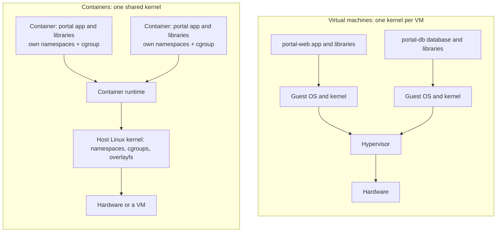

# Diagram D12 – Virtual Machines versus Containers (supports A4.1 and A4.2)

```mermaid
flowchart TB
    subgraph VMS["Virtual machines: one kernel per VM"]
        direction TB
        V1["portal-web app and libraries"]
        V1K["Guest OS and kernel"]
        V2["portal-db database and libraries"]
        V2K["Guest OS and kernel"]
        VH["Hypervisor"]
        VHW["Hardware"]
        V1 --> V1K --> VH
        V2 --> V2K --> VH
        VH --> VHW
    end
    subgraph CTR["Containers: one shared kernel"]
        direction TB
        C1["Container: portal app and libraries<br/>own namespaces + cgroup"]
        C2["Container: portal app and libraries<br/>own namespaces + cgroup"]
        CE["Container runtime"]
        CK["Host Linux kernel: namespaces, cgroups, overlayfs"]
        CHW["Hardware or a VM"]
        C1 --> CE
        C2 --> CE
        CE --> CK --> CHW
    end
```

Containers have no guest kernel, so they start faster and use less memory; VMs have a stronger isolation boundary.
